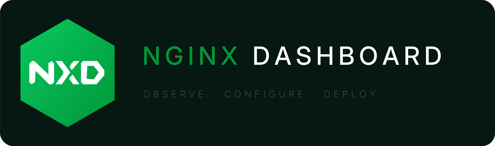

<p align="center">
  
</p>

<h1 align="center">nginx-dashboard</h1>

<p align="center">
  A web dashboard that controls NGINX entirely via buttons — no command line.<br>
  Runs next to nginx on your Ubuntu/Debian server.
</p>

## What it does

| Tab | What it does |
|---|---|
| **sites** | create / edit / enable / disable server blocks: reverse proxy, load balancing, PHP & FastCGI, HTTPS (Let's Encrypt, self-signed or your own certs), rate limiting, IP rules, basic auth, gzip, HTTP/2 & 3 — plus a file manager, zip deploy and one-click WordPress |
| **control** | start / stop / restart / reload nginx, test the config, publish a vhost for the dashboard itself |
| **logs** | live tail of access & error logs, rotate, purge |
| **metrics** | stub_status stats and a live connections chart |
| **settings** | second factor, sign-in lockouts, new-site defaults, undo history, updates, LEMP install, dark/light |

Every change is tested with `nginx -t` before nginx reloads, so a config nginx
rejects never reaches it — and every successful change is undoable.

## Try it

```bash
npm install
npm run demo
```

DRY mode on your own machine — it never touches nginx, systemctl or certbot.
Opens on http://127.0.0.1:7412, password `demo`.

## Install on a server

Copy the folder (including `dist/`) to the server and run the installer:

```bash
ssh user@server 'sudo bash /tmp/nginx-dashboard/deploy/install.sh'
```

It installs a systemd unit, generates a `DASH_PASSWORD` (printed once), and binds
to `127.0.0.1:7412` — reach it over an SSH tunnel or publish its own vhost from
the Control tab. Optional `--lemp` adds MariaDB and PHP-FPM.

**Full deployment guide — environment variables, LEMP stack, updates, lockout
recovery:** [deploy/README.md](deploy/README.md)

## Security

- One password, set in the unit file; placeholder values refuse to start.
- Five failed sign-ins lock the address out for fifteen minutes.
- Optional TOTP second factor, enrolled in the UI.
- Anyone with the password effectively has root: keep it strong.

## Development

```bash
npm run build   # build the frontend into dist/
npm run dev     # Vite on :5173, proxies /api to :7412
npm test        # all suites
```