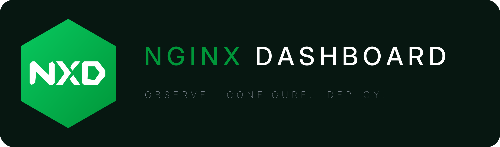

<p align="center">
  
</p>

<h1 align="center">nginx-dashboard</h1>

<p align="center">
  A web dashboard that controls NGINX entirely via buttons — no command line.<br>
  Runs next to nginx on your Ubuntu/Debian server.
</p>

## What it does

| Tab | What it does |
|---|---|
| **sites** | create / edit / enable / disable server blocks: reverse proxy, load balancing, PHP & FastCGI, HTTPS (Let's Encrypt, self-signed or your own certs), rate limiting, IP rules, basic auth, gzip, HTTP/2 & 3 — plus a file manager, zip deploy and one-click WordPress |
| **control** | start / stop / restart / reload nginx, test the config, publish a vhost for the dashboard itself |
| **logs** | live tail of access & error logs, rotate, purge |
| **metrics** | stub_status stats and a live connections chart |
| **settings** | second factor, sign-in lockouts, new-site defaults, undo history, updates, LEMP install, dark/light |

Every change is tested with `nginx -t` before nginx reloads, so a config nginx
rejects never reaches it — and every successful change is undoable.

## Try it

```bash
git clone https://github.com/mangyan1/nginx-dashboard.git
cd nginx-dashboard
npm install
npm run demo
```

DRY mode on your own machine — it never touches nginx, systemctl or certbot.
Opens on http://127.0.0.1:7412, password `demo`.

## Install on a server

Log into the server, clone the repo, run the installer. The server needs `git`
(`apt install git` first if it hasn't).

```bash
ssh root@203.0.113.5        # log in — everything below runs on the server
git clone https://github.com/mangyan1/nginx-dashboard.git
cd nginx-dashboard
sudo bash deploy/install.sh --lan   # installs node, nginx and the app; --lan opens it to your LAN
```

The installer needs root — logged in as root with no `sudo` on the box, plain
`bash deploy/install.sh` does the same. No build step anywhere: the built
frontend (`dist/`) ships with the repo, and the installer adds the rest — node,
nginx, certbot, the app's npm packages — into `/opt/nginx-dashboard`, then
prints a generated `DASH_PASSWORD`.

`--lan` puts the dashboard on your LAN: with ufw active the installer opens
7412 and the web ports 80/443 to your private subnet, so from any machine:
`http://<server-IP>:7412`. Without it, the dashboard binds to `127.0.0.1`
only. Optional `--lemp` adds MariaDB and PHP-FPM.

### After install — first use

1. **Sign in** from any machine on the LAN: `http://<server-IP>:7412`, with the
   password the installer printed (find it again on the server:
   `sudo grep DASH_PASSWORD /etc/systemd/system/nginx-dashboard.service`).
2. **Set your own password** — it lives in the unit file. On the server:
   ```bash
   sudo sed -i 's|^Environment=DASH_PASSWORD=.*|Environment=DASH_PASSWORD=your-password|' /etc/systemd/system/nginx-dashboard.service
   sudo systemctl restart nginx-dashboard
   ```
3. **Give it a clean URL** — Control → "Reaching this dashboard" → Publish →
   enable the site: the dashboard then answers on plain `http://<server-IP>`,
   no port number, allowlisted to private ranges.
4. **Put up a site** — the Sites tab: create the vhost, point it at a docroot,
   upload your files, enable. Every change passes `nginx -t` first and is
   undoable.

It stays LAN-only: the published vhost denies everything but private ranges,
and the ufw rules the installer added gate 7412, 80 and 443 to your subnet.

**Full deployment guide — building your own frontend, environment variables,
LEMP stack, updates, lockout recovery:** [deploy/README.md](deploy/README.md)

## Security

- One password, set in the unit file; placeholder values refuse to start.
- Five failed sign-ins lock the address out for fifteen minutes.
- Optional TOTP second factor, enrolled in the UI.
- Anyone with the password effectively has root: keep it strong.

## Development

```bash
npm run build   # build the frontend into dist/
npm run dev     # Vite on :5173, proxies /api to :7412
npm test        # all suites
```